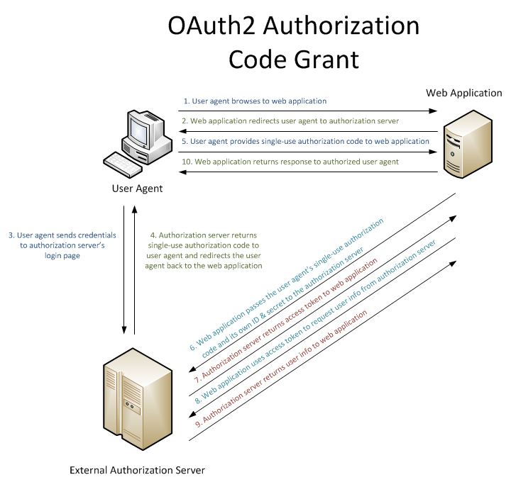
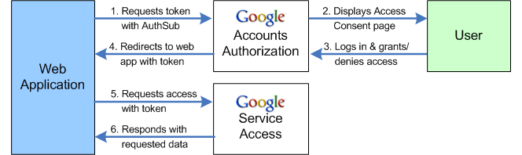
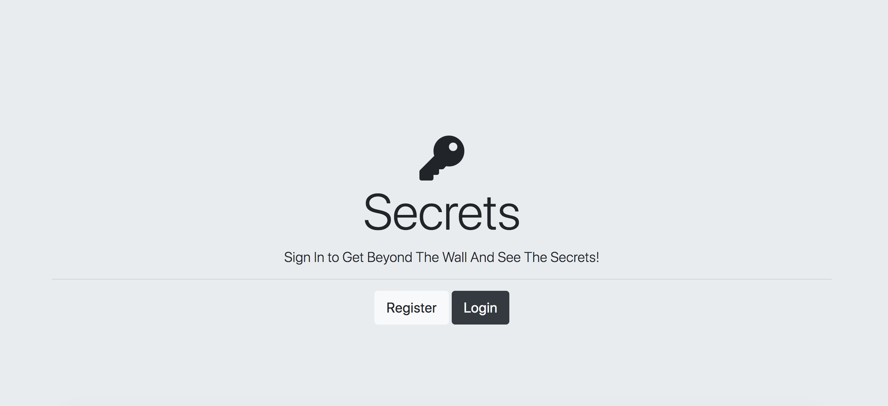
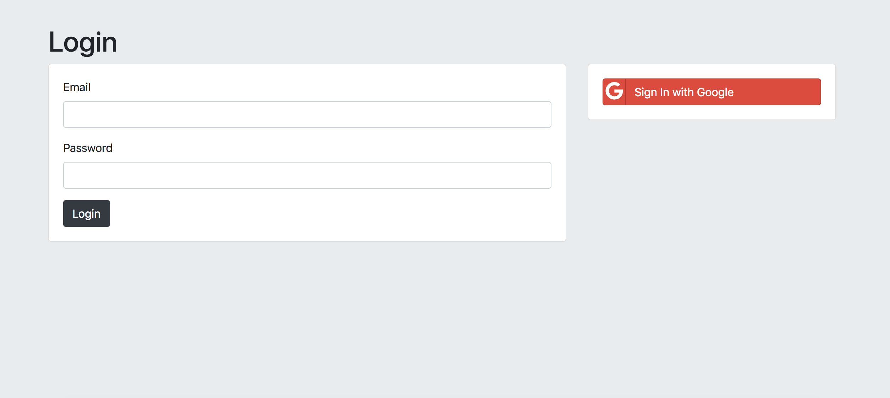
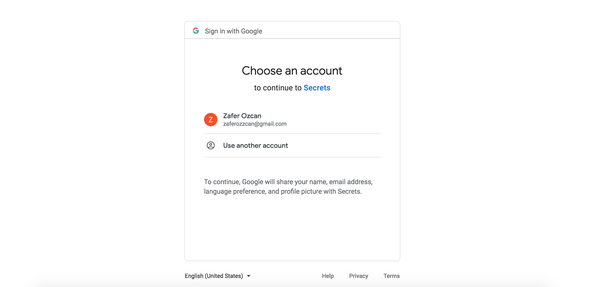

# Login-Page-With-Google-OAUTH
# Login-Page-With-Level-1-Authentication
The app examples Level 1 credentials, which is the most basic level auth. Authentication is done with a simple password challenge-response protocol, This method is the most valnurable to third-party attacks.

# How third party authentication works

# App

<h3>User must regsiter before log in. Database will keep credentials of the user.</h3>
<h3> User must enter the correct username/email and password to access the secrets page.</h3>
<h3>After obtaining credentialS, user is able to get the end page.</h3>

# Technologies:
<li> HTML</li>
<li>JavaScript </li>
<li>CSS </li>
<li>express.js with node.js </li>
<li>EJS </li>
<li>npm packages </li>
<li>git</li>

# Project Outcomes
<ul>
  <h3> Understanding Templating vs.
Layouts</h3>
  <li> Running Code Inside the EJS
Template </li>
  <li> Passing Data from Your Webpage
to Your Server </li>
  <li> Adding Pre-Made CSS Stylesheets
to Your Website</li>
  <li>Understanding Node Module Exports--How to Pass Functions and Data between Files </li>
  <li>Understanding Level 1 Authentication<li>
  
</ul>

# Install
$ git clone 
$ cd PROJECT
